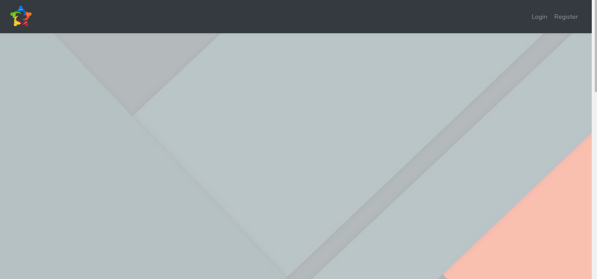

> about the project

This website links three types of people [normal people - store owners - delivery guys]. and divide the city into hoods. each store will register in a hood and the normal person will also register in a hood, and finally, the delivery man will also register in the same hood. the registered account in hood1 can't see the accounts registered in hood2.
This project was a participation in a Hackathon to propose solutions to the problems that occurred after COVID-19, this project is the solution for the stores closing

>How does the project work:

## landing page of the project
###click on Register

## supplier account creation
###fill the form and submit
[image 2]

## supplier dashboard [before having a store]
###click on create store
[image 3]

## store creation form
fill the form and submit
[image 4]

## supplier account dashboard [after having a store]
###click on add product
[image 5]

## adding product form [square images are prefared]
fill the form then submit
[image 6]

## the store
logout and create buyer account
[image 7]

## creating buyer account [same hood]
fill the form then submit
[image 8]

## buyer account dashboard
can see only stores in the same hood
[image 9]

## store products
here the buyer can see the products and fill his cart
[image 10]

## buyer cart
here is the products will be listed in the cart
[image 11]

## quantity added ( + )
if the buyer wants two panadol extra he can add and remove
[image 12]

## after checkout and the address is added
[image 13]

## check the order form All Orders page
[image 14]

## All Orders page
the order is "pending" waiting for a dilevery guy to take it, logout and register as a dilevery guy
[image 15]

## creating dilevery account [same hood]
fill the form then submit
[image 16]

## dilevery account dashboard
can see only orders in the same hood
[image 17]

> requirements
1) composer (laravel)
2) Xampp (database that runs locally)

> install it on your machine
1) `git clone "THE LINK"`
2) `cd stores_website`
3) change the database name in `.env` file - rename it first from `example.env` to `.env`
4) `php artisan migrate --seed`
5) `php artisan migrate serve`

